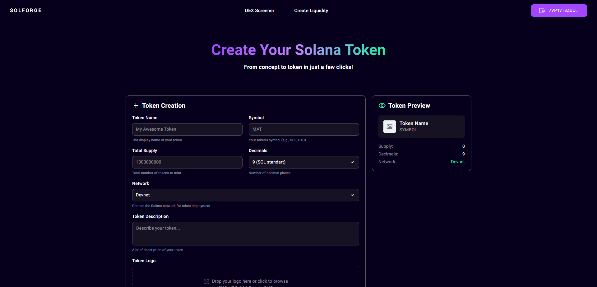

# SolForge

Проект по созданию собственных токенов Solana с валидацией, загрузкой метаданных, создания pool'а и выбором сети Devnet и Mainnet Beta



## Dev стак

Next.js, TypeScript, SCSS, Zustand, web3.js, Metaplex, Solana

## Запуск проекта

Инструкция по настройке и запуску проекта на локальном компьютере.

1. **Клонирование репозитория:**

```bash
git clone https://github.com/Ibarakilol/sol-forge.git
cd sol-forge
```

2. **Установка зависимостей и запуск:**

```bash
npm i && npm run dev
```
